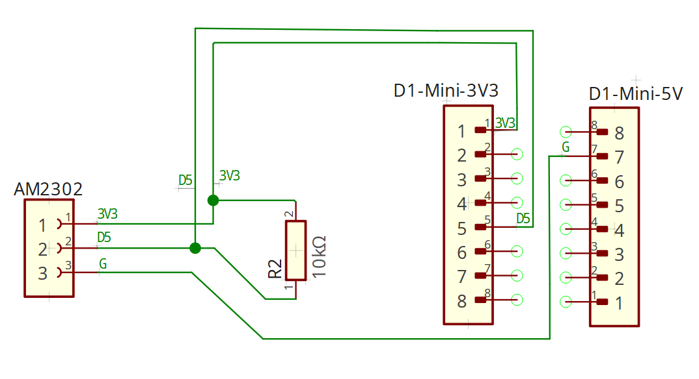

# ESP8266 using AM2302 with Home Assistant discovery

## Table of Contents

- [Hardware](#hardware)
  - [ESP8266 Espressif Wemos D1 Mini](#esp8266-espressif-wemos-d1-mini)
  - [DHT22 (AM2302) Temperature and Humidity Sensor](#dht22-am2302-temperature-and-humidity-sensor)
- [Setup](#setup)
  - [Circuit diagram](#circuit-diagram)
  - [VSCode-Arduino extension setup](#vscode-arduino-extension-setup)
    - [VSCode-Arduino Serial Monitor](#vscode-arduino-serial-monitor)
  - [Manually installed libraries](#manually-installed-libraries)
    - [HARestAPI](#harestapi)
    - [ESPAsyncWebServer](#espasyncwebserver)
- [Home Assistant Integration](#home-assistant-integration)
  - [Example card](#example-card)
- [ESP8266 OTA update](#esp8266-ota-update)

## Hardware

### ESP8266 Espressif Wemos D1 Mini

ESP branding looks like to be a chaotic mess.
You can clearly see Espressif brand logo on the board, but it's called ESP8266 Wemos D1 Mini?
I bought it on [Amazon.de](https://www.amazon.de/dp/B0CB85Q78G?psc=1&ref=ppx_yo2ov_dt_b_product_details).\
Datasheet can be found [here](https://www.espressif.com/sites/default/files/documentation/0a-esp8266ex_datasheet_en.pdf).

### DHT22 (AM2302) Temperature and Humidity Sensor

AM2302 is the same a s DHT22, but with a plastic cover.\
Datasheet can be found [here](https://cdn.shopify.com/s/files/1/1509/1638/files/DHT_22_-_AM2302_Temperatur_und_Luftfeuchtigkeitssensor_Datenblatt.pdf?11983326290748777409).

## Setup

Copy and paste `credentials.h-SAMPLE` to `credentials.h` and fill in your credentials appropriately,\
but double check to **do not store credentials in git**.

### Circuit diagram



### VSCode-Arduino extension setup

- Install [VSCode](https://code.visualstudio.com/)
- Install [Arduino CLI](https://arduino.github.io/arduino-cli/0.21/installation/#download)
  - Put the `arduino-cli.exe` for example in\
  `C:\Program Files\Arduino-CLI` and run

  ```cmd
  set PATH=%PATH%;C:\Program Files\Arduino-CLI
  ```

- and/or install [Arduino IDE](https://www.arduino.cc/en/Main/Software), but I prefer **CLI**
- Install the [Arduino extension](https://marketplace.visualstudio.com/items?itemName=vsciot-vscode.vscode-arduino)
- Press `F1` and type `Select Board` select `Arduino: Board Manager`. Expand `Type` and select ESP8266. Select the latest version and install it.
- Press `F1` and type `Select Port` select `Arduino: Select Serial Port`. Select the port your ESP8266 is connected to.
- Press `Ctrl+Shift+I` for rebuilding IntelliSense Configuration.
- Press `Ctrl+Shift+R` for compiling the sketch. This will generate a new Arduino configuration in the `c_cpp_properties.json` file. Then reload VSCode.
- Use `Ctrl+Alt+U` to upload the sketch to the board.

#### VSCode-Arduino Serial Monitor

- Press `F1` and type `Open Serial Monitor` select `Arduino: Open Serial Monitor`.

### Manually installed libraries

Library management is only easy, when those are provided by Arduino Library Manager, otherwise it's a bit annoying. [Further readings!](https://github.com/arduino/Arduino/pull/11110)

#### HARestAPI

Download the [HARestAPI v0.3.2](https://github.com/debsahu/HARestAPI/releases/tag/v0.3.2) library and extract its content to `C:\Users\%USERNAME%\Documents\Arduino\libraries\HARestAPI`.

#### ESPAsyncWebServer

Download the [ESPAsyncWebServer-master](https://github.com/me-no-dev/ESPAsyncWebServer) library and extract its content to `C:\Users\%USERNAME%\Documents\Arduino\libraries\ESPAsyncWebServer`.

## Home Assistant Integration

The sensor will be automatically added as `entities` in Home Assistant, but not as a device.\
Entity IDs will be\
`sensor.esp8266_thcs_{n}_temperature`,\
`sensor.esp8266_thcs_{n}_humidity` and\
`sensor.esp8266_thcs_{n}_wifi_rssi`.

`{n}` is the number of the device, starting with 1 and can be configured in `credentials.h`, see `#define SECRET_DEVICE_NAME`.

### Example card

I am using a horizontal-stack card:

```yaml
title: Garage
type: horizontal-stack
cards:
  - type: tile
    entity: sensor.esp8266_thcs_1_temperature
    name: Temperature
    icon: mdi:thermometer
    state_content:
      - state
      - last-changed
    vertical: true
  - type: tile
    name: Humidity
    icon: mdi:water-percent
    show_entity_picture: false
    vertical: true
    hide_state: false
    state_content:
      - state
      - last-changed
    entity: sensor.esp8266_thcs_1_humidity
  - type: gauge
    entity: sensor.esp8266_thcs_1_wifi_rssi
    unit: dBm
    name: WiFi RSSI
    needle: true
    max: -30
    severity:
      green: -50
      yellow: -70
      red: -90
    min: -90
```

## ESP8266 OTA update

In `credentials.h` you need to set all `#define`s to your needs.\
Depending on your `SECRET_DEVICE_NAME` and `SECRET_WEB_SERVER_PORT` the OTA update URL will be\
`http://{SECRET_DEVICE_NAME}.local:{SECRET_WEB_SERVER_PORT}/update` like so\
[http://esp8266-thcs-1.local:80/update](http://esp8266-thcs-1.local:80/update).

Make sure to adjust your `.vscode/arduino.json` file with:

```json
{
  ...,
  "output": "build"
}
```

After the first upload, you can use the OTA update on the same network with [http://esp8266-thcs-1.local:80/update](http://esp8266-thcs-1.local:80/update) and select the `build\\main.ino.bin` file.
